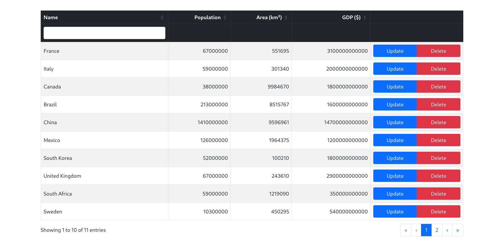

## **Django Server-side Datatable Example**

A simple example of how you can use the Datatables.net library with Django, implementing server-side processing using the django-ajax-datatable library.

## **Features**

1. List Countries: Display a paginated list of countries.

2. Sorting: Order countries by Population, Area, and GDP in ascending or descending order.

3. Filtering: Filter the list by country name.

4. Editing: Update country data by clicking on the "Update" button or anywhere on the row.

5. Deletion: Delete a record via an AJAX call. A confirmation modal appears before deletion, and upon success, a toast message confirms the action.

## Some notes
When working with django-ajax-datatable, I noticed that code from static folder ( JavaScript and CSS (including initialize_table.js) ) modify the table layout in an undesirable way. Specifically:
1. The pagination with datatable information and "records per page" with search are not aligned properly.
2. The overall UI structure becomes inconsistent with Bootstrap styling.
3. The table looks cluttered and harder to use.
To avoid these issues, I chose not to include the additional ajax_datatable scripts and instead used vanilla DataTables.net initialization. I didn't use default filter fields. Instead I used custom inputs and provided their values to the server for filtering. This ensures a clean and standard UI while still maintaining server-side processing for large datasets.

## **Preview**

